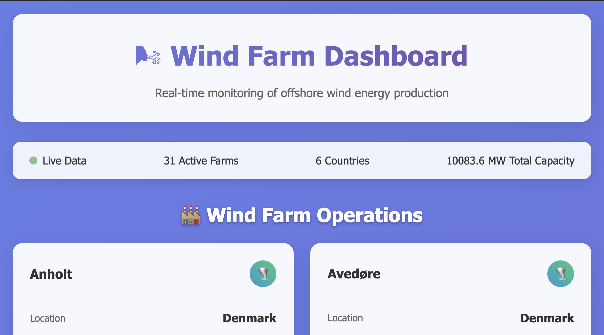

<div style="text-align: center">

# 🤓 The Ørsted Trial: A Day in the Life of a Software Developer ⚡️

This repo contains materials for a 1-day Ørsted workshop, giving IT students hands-on experience in:

</div>

✅ agile teamwork

🐛 real-world debugging

🔄 handling changing requirements

🚢 simulating dynamic software dev environments

# 🌊 Wind Farm Dashboard

A beautiful, real-time dashboard for monitoring offshore wind farms built with Python and Flask. Perfect for learning web development, APIs, and data visualization!



## 🛠 Technologies

- 🐍 Python, core language
- 🌶️ `flask`, lightweight web framework
- 🐼 `pandas`, for data manipulation
- 📈 `openpyxl`, Excel handling
- 🤌 `httpx`, API communication
- 🥷 `Jinja2`, template rendering
- 🎀 `HTML`, frontend

## ✨ Features

- 🔄 Real-time wind speed data from OpenWeatherMap API
- 📊 Power generation estimates using turbine power curves
- 🗺️ Multi-country wind farm monitoring
- 📈 Performance analytics and visualizations
- 🎨 Beautiful, responsive dashboard interface

## 🚀 Quick start

### Prerequisites

Before you begin, ensure you have the following installed:

- [Visual Studio Code](https://code.visualstudio.com/download) or any code editor of your choice
- [`uv`](https://docs.astral.sh/uv/getting-started/installation/)
  - Python 3.13 with `uv` is required to run the application.
    - `uv python install 3.13`
- [Git](https://git-scm.com/downloads)

### Clone and setup ⚙️

```bash
# Clone the repository
git clone https://github.com/dorota-ostrowska/dev-day-simulation
cd dev-day-simulation

# Create virtual environment
uv venv

# Activate virtual environment
# On Windows:
.venv\Scripts\activate
# On macOS/Linux:
source .venv/bin/activate

# Install dependencies
uv pip install -r requirements.txt -r requirements-dev.txt
```

### Get your API key 🔑

To access weather data, you need a free API key from OpenWeather:

1. Go to [https://openweathermap.org/](https://openweathermap.org/) and create a free account.
1. After logging in, navigate to the [API keys section](https://home.openweathermap.org/api_keys).
1. Provide a name of your key (e.g., `dev-day-simulation-key`), click **Create key**.
1. Copy your unique API key (the long string).
1. Store this key in your configuration file `private_config.py` in the `wind_app` folder.

> ⚠️ **Security Warning**: Keep your API key private! Never commit it to version control or share it publicly. The `private_config.py` file is already in `.gitignore` to prevent accidental commits. If you don't know why API key should stay private - find out why by [visitting the link](https://www.shopify.com/blog/api-key-explained).

### Run the application 🏃

```bash
# Start the development server
uv run python -m main
```

### Run the tests 🧪

Run unit tests with:

```bash
uv run pytest
```

Run integration tests (requires a valid OpenWeatherMap API key) with:

```bash
uv run pytest -m "integration_test"
```

Visit [http://localhost:5000](http://localhost:5000) to see your wind farm dashboard! 🎉

## 📁 Project Structure

```bash
wind-farm-dashboard/
├── main.py                         # Application entry point
├── requirements.txt                # Python dependencies for the application
├── requirements-dev.txt            # Python dependencies for development
├── data/
│   └── windfarms.xlsx              # Wind farm data
├── wind_app/
│   ├── __init__.py                 # Flask app factory
│   ├── private_config.py            # Your API key (not in git)
│   ├── routes/
│   │   └── home.py                 # Dashboard route handler
│   ├── services/
│   │   ├── wind_farm_dashboard.py  # Main dashboard logic
│   │   ├── excel_service.py        # Excel data loading
│   │   └── weather_service.py      # Weather API integration
│   └── templates/
│       ├── base.html.j2             # HTML template base
│       └── home.html.j2            # Dashboard template
└──  tests/                         # Test files
```

## 🧠 How does it work

### Data flow ⚙️

1. **📂 Load Data**: Read wind farm information from Excel file
2. **🌬 Fetch Weather**: Get current wind speeds for each farm location
3. **⚡ Calculate Power**: Use wind turbine power curves to estimate output
4. **🖼 Format Display**: Prepare data for beautiful dashboard presentation
5. **🖥 Render Dashboard**: Show real-time wind farm performance

### Core components 🧩

- **WindFarmDashboard**: Main orchestration logic
- **WeatherService**: Talks to OpenWeatherMap
- **ExcelService**: Reads .xlsx data
- **Templates**: UI with Jinja2 and HTML

## 💡 Ideas for features

- [ ] Add link to the map view of wind farms
- [ ] Add refresh button to the dashboard which will reload data
- [ ] Add loading screen
- [ ] Implement historical data analysis
- [ ] Visualize data on charts
- [ ] Filter farms by country
- [ ] Look through the code for `TODO:` comments and implement them

## 📄 License

This project is part of `The Ørsted Trial: A Day in the Life of a Software Developer` workshop materials. It’s intended for educational, non-commercial use. 🌱

---

**Happy coding! 🚀 Build something amazing with renewable energy data!**

<div style="text-align: center">

**Made with 💚 for renewable energy**

</div>
