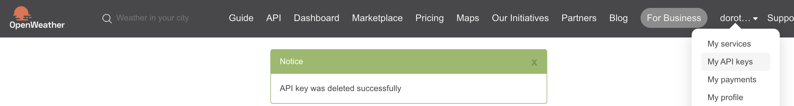
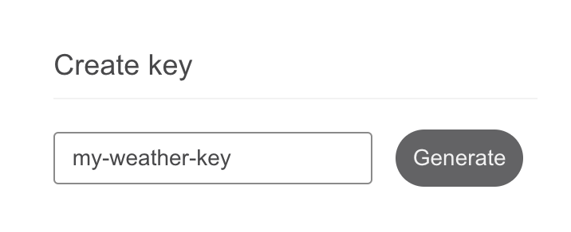
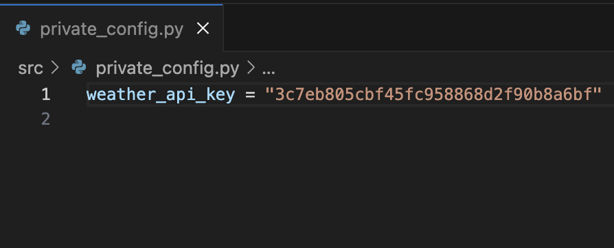

# The Ørsted Trial: A Day in the Life of a Software Developer 🤓
This repo contains materials for a 1-day Ørsted workshop, giving IT students hands-on experience in agile, team collaboration, bug fixing, and handling changing requirements. Work on real-world scenarios to explore the dynamic nature of software development.

# 🌊 Wind Farm Dashboard
A beautiful, real-time dashboard for monitoring offshore wind farms built with Python and Flask. Perfect for learning web development, APIs, and data visualization!

## Technologies 🛠
- Python 🐍
- Flask 🌶️
- Pandas 🐼
- Openpyxl 📈
- Requests 🤌
- HTML/CSS 🎀
- Jinja2 🥷

## Prerequisites 📋
Before you begin, ensure you have the following installed:
- [Visual Studio Code](https://code.visualstudio.com/download)
- [Python 3.13.2](https://www.python.org/downloads/)
- [Git](https://git-scm.com/downloads)

## 🚀 Quick start

### 1. Clone and setup

```bash
# Clone the repository
git clone https://github.com/dorota-ostrowska/dev-day-simulation
cd dev-day-simulation

# Create virtual environment
python -m venv venv

# Activate virtual environment
# On Windows:
venv\Scripts\activate
# On macOS/Linux:
source venv/bin/activate

# Install dependencies
pip install -r requirements.txt
```

### 2. Get your API key
To access weather data, you need a free API key from OpenWeather:

1. Go to [https://openweathermap.org/](https://openweathermap.org/) and create a free account.
2. After logging in, navigate to the [API keys section](https://home.openweathermap.org/api_keys).

3. Provide a name of your key (e.g., `my-weather-key`), click **Create key**. 

4. Copy your unique API key (the long string).

5. Store this key in your configuration file `private_config.py` in the `src` folder.

> ⚠️ **Security Warning**: Keep your API key private! Never commit it to version control or share it publicly. The `private_config.py` file is already in `.gitignore` to prevent accidental commits.

### 3. Run the application

```bash
# Start the development server
python main.py
```

Visit [http://localhost:5000](http://localhost:5000) to see your wind farm dashboard! 🎉

## 📁 Project Structure

```
wind-farm-dashboard/
├── main.py                          # Application entry point
├── requirements.txt                 # Python dependencies
├── data/
│   └── windfarms.xlsx              # Wind farm data
├── src/
│   ├── __init__.py                 # Flask app factory
│   ├── private_config.py           # Your API key (not in git)
│   ├── routes/
│   │   └── home.py                 # Dashboard route handler
│   ├── services/
│   │   ├── wind_farm_dashboard.py  # Main dashboard logic
│   │   ├── excel_service.py        # Excel data loading
│   │   └── weather_service.py      # Weather API integration
│   └── templates/
│       ├── base.html               # HTML template base
│       └── home.html               # Dashboard template
├── tests/                          # Test files
└── docs/                           # Images in readme
```

## 🧠 How it works

### Data Flow
1. **Load Data**: Read wind farm information from Excel file
2. **Fetch Weather**: Get current wind speeds for each farm location
3. **Calculate Power**: Use wind turbine power curves to estimate output
4. **Format Display**: Prepare data for beautiful dashboard presentation
5. **Render Dashboard**: Show real-time wind farm performance

### Key components

- **WindFarmDashboard**: Main class that orchestrates everything
- **WeatherService**: Handles OpenWeatherMap API calls
- **Excel Service**: Loads wind farm data from spreadsheets
- **Templates**: Beautiful HTML/CSS for the user interface

## 🤝 Contributing

1. Fork the repository
2. Create a feature branch: `git checkout -b feature-name`
3. Make your changes and test them
4. Commit: `git commit -m "Add feature"`
5. Push: `git push origin feature-name`
6. Create a Pull Request

## 📄 License

This project is part of the Ørsted developer workshop materials.

---

**Happy coding! 🚀 Build something amazing with renewable energy data!**